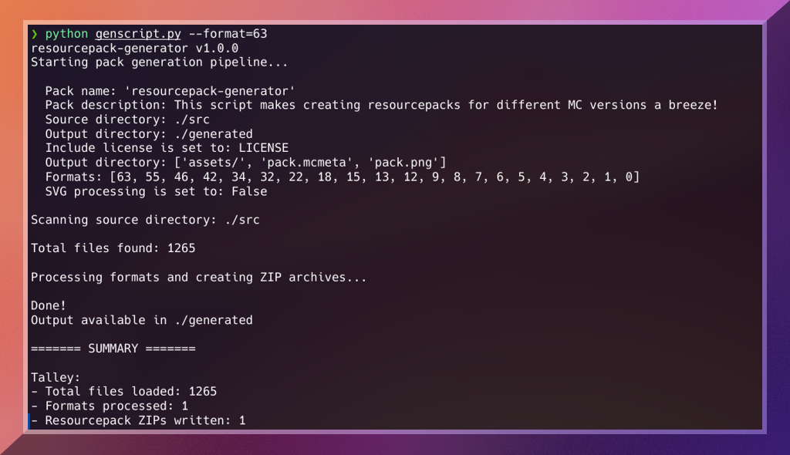

## respack-genscript

> Easily create resourcepacks for various multiple Minecraft: Java Edition versions.



# About

This project originated out of necessity for a better solution to the problem of supporting many Minecraft versions in a GUI resourcepack I maintain, [Dracula Theme](https://github.com/dracula/minecraft) (soon to be rebranded). At the time, I implemented it as a Bash script with many quirks and limitations. It worked well for what it was, but it had potential to be better...

Enter `respack-genscript`, a Python script souped up with a number of bells and whistles, including:

- High user-friendliness. If something isn't right, **it tells you**.
- Generate respacks for all Minecraft versions, or **just one** specific version.
- **Robust error handling** and logging, with **handy statistics** about your packs.
- **Mutliple verbosity options** for debugging.
- Pack only necessary files in each .zip using the **file exclusion and inclusion** system.
- Temporary files are **held in memory**, minimizing disk writes.
- And plenty of other nice-to-haves

But, that's not all. There are two more functionalities: **SVG Theming** and **SVG-to-PNG** conversion. These are important features for UI-focused packs that use vector graphics instead of bitmap images, however, it's a very niche use case (only pack I know of that does this is Dracula Theme), so it is disabled by default.

# Getting Started

An easy way to start using this script is to simply clone or fork the repository. Alternatively, click the "Code" button above and download the files as .zip

Once you have the repository files set up, you'll notice an `assets` folder and a bunch of numbered directories and .json files inside of `/src`. the `assets` folder functions as you would expect in any resourcepack, and the other items are for per-format file sorting:

- `/src/[format].json` files contain a list of filepaths. When that version is generated, the script **removes** these entries from the resulting pack.
- `src/[format]` directories essentially act as `src` directories with a different name. When the corresponding format is generated, the script **merges** these entries into the resulting pack, eg. `src/63/assets/minecraft/...` -> `src/assets/minecraft...`

The script always starts with the highest pack format present in `/buildcfg.json` and works its way down. Also, **exclusions happen first**. If you need to replace a file with another, make sure to add it to the exclusion list first. Files will not be overwritten when merging.

Speaking of `buildcfg.json`, this file contains various configuration parameters for how the script handles the files you give it. To give a quick rundown...

## Configuration options:

- `name`: The name of your resourcepack. This is used for naming .zip files.
- `description`: The description of your pack. This will be used for the pack.mcmeta files it creates.
- `source_dir`: Directory to load pack files from. Generally should be left as-is.
- `output_dir`: Directory to put the created resourcepacks.
- `license_file`: Name of the license file in the same folder as the script. Makes it so you don't have to have a copy inside `/src`
- `allowed_paths`: List of paths inside `source_dir` the script will add to output packs. Useful if you have unusual files to include.
- `formats`: Dictionary of pack formats with assotiated versions. The formats are very important for script function, and the values (version names) for each one are used for .zip file naming.

#### SVG processing-specific:

- `process_svg_images`: If `true`, the script will enable extra features for processing vector graphics. If `false`, all other related settings remain unloaded and can be omitted. 
- `scales`: Dictionary of `scale: dpi` mappings to use. Resourcepacks are created in subdirectories for each format if `process_svg_images` is true.
- `theme_dir`: Directory path that the script will look for theme files in.
- `default_colors`: `color name: hex code` mappings. When a theme is provided, the script will search for these codes and replace them with ones in the theme file with the same name.


# Usage

To start running the script, you will need [Python](https://www.python.org/downloads/) installed. Binaries are available for Windows and MacOS. For linux, check for it in your package manager. Just about any modern Python3 release will do.

No external dependencies are required, unless you want to use the SVG-to-PNG functionality, in which case you'll need [CarioSVG](https://cairosvg.org/documentation/) installed as well.

You can use the `--help` flag to get some useful information:

```
❯ python genscript.py --help
usage: respack-genscript [-h] [--version] [-v] [-vv] [-q] [-d] [--theme THEME] [--scale SCALE] [--format FORMAT] [--packver PACKVER]

Processes resourcepack sources and creates ready-to-use .zip files

options:
  -h, --help           show this help message and exit
  --version            show program's version number and exit
  -v, --verbose        Print out live status info and error messages
  -vv, --very-verbose  Print out each path as it is accessed
  -q, --quiet          Run without any feedback
  -d, --dry-run        Skip writing .zip archives to disk
  --theme THEME        Specify a theme to apply color mappings from (e.g., "--theme=nord")
  --scale SCALE        Generate only for a specific scale (e.g., "--scale=3" for 72DPI)
  --format FORMAT      Generate only for a specific format key (e.g., "--format-key=18")
  --packver PACKVER    Pack version string to use. Defaults to "dev"
```

## Contributing

Any contributions to this project is greatly appreciated! Currently the most lacking parts are the `/src/[format].json` files. If you are able to help improve the lists of files that aren't used in older Minecraft versions, please submit a pull request.

Likewise, documentation on what files should be put each `/src/[format]` directory are also needed. I don't yet know how this will be presented, but having the information ready is a start.

And of course, bug reports and general feature requests are always welcome as well. Thanks!

## Resources

- Come hang out and share cool stuff with the community on [Discord](https://discord.gg/3gtNAQgv2G)!
- [Installing resourcepacks (wiki page)](https://minecraft.wiki/w/Tutorials/Loading_a_resource_pack) 

## License

[GNU General Public License v3.0](./LICENSE)
